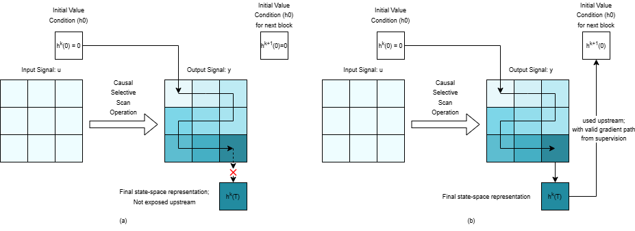
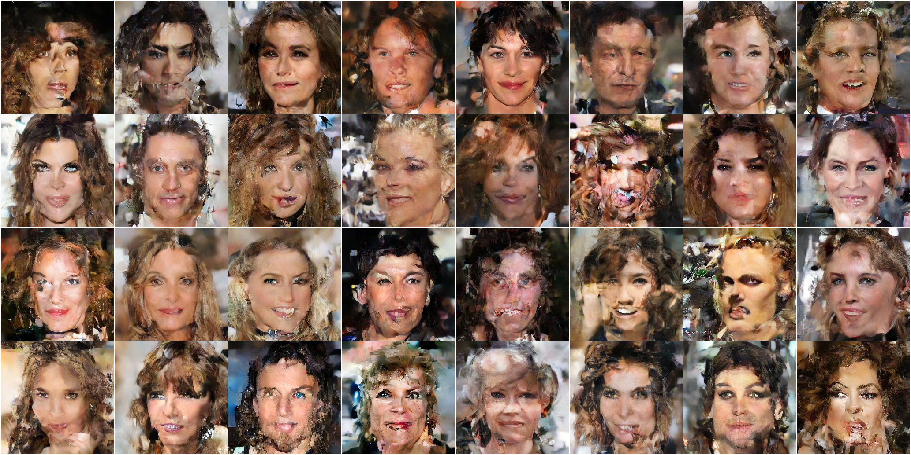
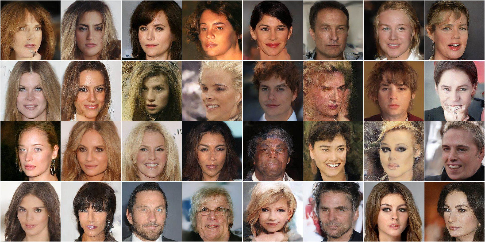
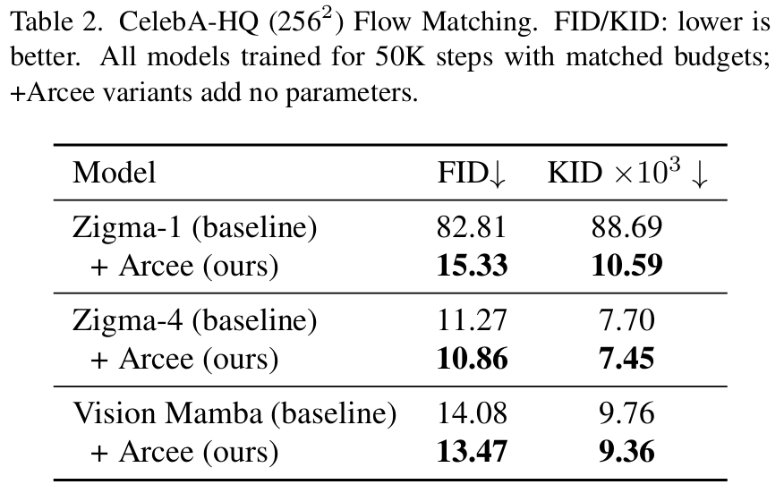

#  Arcee: Differentiable Recurrent State Chain for Generative Vision Modeling with Mamba SSMs (2025)

## Overview

This repository represents official implementation of the paper [Arcee: Differentiable Recurrent State Chain for Generative Vision Modeling with Mamba SSMs](https://arxiv.org/abs/2511.11243)

Arcee is a **drop-in architectural modification** for Mamba-based DNNs for vision (non-sequential signals). Instead of resetting every Mamba block with a zero state, Arcee **reuses the terminal state-space representation** $(h_T^{(k)})$ of block $\(k\)$ as the initial state $\(h_0^{(k+1)}\)$ of block $\(k+1\)$ via a differentiable boundary map. The result is a **cross-block recurrent state chain** that:

- relaxes causality of conventional selective scan manifold introduced in Mamba, across depth, for images and other non-sequential signals,
- preserves Mamba’s **linear-time selective scan** and implementation,
- is **parameter-free** and adds **constant, negligible overhead**.

In our paper, plugging Arcee into a single-scan Zigzag Mamba Flow Matching model on **CelebA-HQ 256×256** yields a **lower FID at the same compute budget**, demonstrating that terminal SSR can act as a useful global prior rather than being discarded.


*(a)* In a vanilla Mamba block, the selective scan is strictly causal: the state is initialized with $h^{(k)}(0)=0$, the terminal state $h^{(k)}(T)$ is discarded after producing $y$, and the next block again starts from zero. Darker cells indicate positions that have accumulated more context (later timesteps have seen a larger prefix of the sequence).  
*(b)* Arcee extends the scan to a two-port block: the terminal SSR $h^{(k)}(T)$ is reused as the initial state $h^{(k+1)}(0)$ of the next block via a differentiable boundary map, creating a recurrent state chain across depth with a valid gradient path and no change to the intra-block dynamics.

## Qualitative Samples (CelebA-HQ 256×256)
| (a) Zigma-1 baseline | (b) Zigma-1 + Arcee |
| -------------------- | ------------------- |
|  |  |
| CelebA-HQ 256×256, Flow Matching, 50 NFEs, 50k-step checkpoint. | Same setup (CelebA-HQ 256×256, Flow Matching, 50 NFEs, 50k-step checkpoint). Arcee yields sharper, more coherent faces under the **same sampling budget**. |

## Model specs and results (CelebA-HQ 256×256)
Note that Arcee **does not** incur additional parameter overhead.

| (a) Main quantitative results | (b) Training loss (Zigma-1 vs Zigma-1 + Arcee) |
| ----------------------------- | ---------------------------------------------- |
|  |  |

**Figure:** (a) Main quantitative results on CelebA-HQ 256×256 (Flow Matching, 50 NFEs, 50k-step checkpoint).  
(b) Training loss curves for the Zigma-1 baseline and Zigma-1 + Arcee at scan-order 1; other scan orders show similar loss behavior and are omitted for brevity.


## Environment Setup
```bash
# 1) Create and activate env (Python 3.10.8)
conda create -n arcee-mamba python=3.10.8
conda activate arcee-mamba

# 2) Install CUDA 12.8 toolkit inside the env
conda install nvidia/label/cuda-12.8.0::cuda-toolkit

# 3) Install Python requirements
pip install -r req.txt

# 4) Install PyTorch 2.8 with CUDA 12.8 wheels (make sure cuda-toolkit and torch version match)
pip3 install torch torchvision
# or try
pip3 install "torch==2.8.0" "torchvision==0.19.0" \
  --index-url https://download.pytorch.org/whl/cu128

# 5) Build local extensions
cd causal_conv1d
pip install -e . --no-build-isolation -vvv

cd ../ArceeMamba
pip install -e . --no-build-isolation -vvv

# 6) From repo root, verify install
cd ..
bash run_test.sh   # if this runs, setup is successful

```
### After setup environment should look something like this 
```bash
nvcc: NVIDIA (R) Cuda compiler driver
Copyright (c) 2005-2025 NVIDIA Corporation
Built on Wed_Jan_15_19:20:09_PST_2025
Cuda compilation tools, release 12.8, V12.8.61
Build cuda_12.8.r12.8/compiler.35404655_0
Torch: 2.8.0+cu128 CUDA build: 12.8 GPU available: True
```
on running 
```bash
nvcc --version
python -c "import torch; print('Torch:', torch.__version__, 'CUDA build:', torch.version.cuda, 'GPU available:', torch.cuda.is_available())"
```

### Version compatibility

This repo builds custom CUDA extensions. We recommend using **matching CUDA versions** for:

- the **PyTorch CUDA runtime** (e.g. `cu128` wheels), and  
- the **system CUDA toolkit** used by `nvcc` (e.g. `cuda-toolkit=12.8.x` via conda).

All commands in this README assume:

- PyTorch `2.8.0` with **cu128** wheels
- `cuda-toolkit 12.8.x` installed in the environment

If you mix different major/minor CUDA versions (e.g. PyTorch cu128 but toolkit 11.x), the extensions may fail to compile or crash at runtime.

Installing mamba might be problematic, refer [here](https://github.com/state-spaces/mamba/issues) for guidance.

## Usage:
A forward and backward pass over the DNN can be set up as follows
(note: the relative imports only work if this script lives inside the `./Arcee` directory):


## Data Prep
We train and evaluate on **CelebA-HQ 256×256** (unconditional generation), using the MM-CelebA-HQ variant from:  
https://github.com/IIGROUP/MM-CelebA-HQ-Dataset

We do **not** host the dataset or provide direct download links due to licensing and privacy considerations.  
In this codebase, the training data is organized in **LMDB** format to enable efficient multi-GPU training.

The expected on-disk layout is:

```text
data_prep/
  celeba256/
    train.lmdb/           # LMDB containing preprocessed CelebA-HQ 256×256 training images
    real_samples/         # Directory of real images used as the FID/KID reference
      000001.png
      000002.png
      ...

- train.lmdb contains CelebA-HQ 256×256 RGB images used for training.
- Images are normalized to the [-1, 1] range before being fed into the model.
- real_samples/ is used as the real distribution for FID/KID evaluation.
```

## Training:
To start Flow Matching training runs on Celeba-HQ 256x256:
```bash
export WANDB_API_KEY="paste_your_key_here"
# from repo root
bash scripts/<RUN_NAME>.sh
```
Several configs are provided in ```scripts```

## Evaluation (FID / KID):

We use [CleanFID](https://github.com/GaParmar/clean-fid) to compute FID/KID on CelebA-HQ 256×256.

Assuming:

- `data_prep/celeba256/real_samples/` contains real CelebA-HQ 256×256 validation images, and  
- `scripts/result/<RUN_NAME>/checkpoints` contains checkpoints that are used to generate samples for evaluation against reference

From repo root, start eval as:

```bash
bash fid50k/<RUN_NAME>.sh \
```
or
for vision mamba experiments, run eval as:
```bash
bash L40Eval/<RUN_NAME>.sh \
```

## Inference

`Arcee/sample_ddp2.py` supports **multi-GPU** inference.

For **single-GPU** inference, you can use the per-run helper script:

```bash
bash inference/<RUN_NAME>/gen.sh
```

## Citation
If you find our work valuable, please cite as:

```bibtex
@article{chavan2025arcee,
  title         = {Arcee: Differentiable Recurrent State Chain for Generative Vision Modeling with Mamba SSMs},
  author        = {Jitesh Chavan, Rohit Lal, Anand Kamat, Mengjia Xu},
  journal       = {arXiv preprint arXiv:2511.11243},
  year          = {2025},
  archivePrefix = {arXiv},
  eprint        = {2511.11243},
  primaryClass  = {cs.CV},
  doi           = {10.48550/arXiv.2511.11243},
  url           = {https://arxiv.org/abs/2511.11243}
}
```

## Acknowledgements:
Everyone who inspired either through their presence of absence. 


