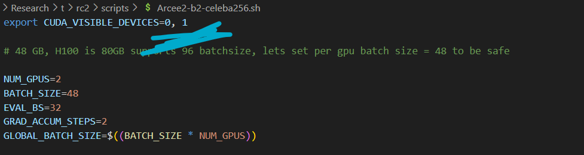
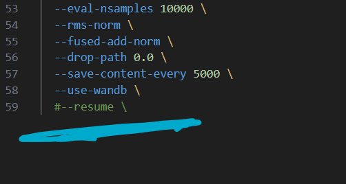

### Vision Mamba Baseline runs on L40:
- git pull origin debug
- cd L40Eval
- run eval for old run on same filesystem/machine as : bash vision_mamba_baseline.sh

### Running Eval
- git pull origin debug
- pip install clean-fid (wasnt there in req.txt before added it now)
- cd eval_scripts
- edit CUDA_VISIBLE_DEVICES in rc1_eval.sh, adjust batch sizes (no experience with inception v3 feature extraction model before so not sure what will work)
- bash rc1_eval.sh
- post error log if any
- the script is supposed to fetch all the checkpoitns for an experiment and run EMA FID10k eval and post it onto wandb across all checkpoint steps

### Starting experiments
- git pull origin debug
- cd data_prep/celeba256
- python download.py
- once the download is finish create lmdb for traning as follows: python convert.py
- after the script finishes : cd ../../scripts and run the two experiments
- Arcee2-b2-celeba256.sh
- Zigma2-b2-celeba256.sh
- make sure to change visible devices to the script, it looks like this assuming 2 gpus per experiment

### How to resume

### Create env. with python 3.10.8
- proceed with following within the environment
- install cuda toolkit 12.8 as : conda install nvidia/label/cuda-12.8.0::cuda-toolkit
- pip install -r req.txt
## Install the torch 2.8 cu128
- pip3 install torch torchvision
## Cd causal_conv1d
- pip install -e . --no-build-isolation -vvv
## Cd mamba
- pip install -e . --no-build-isolation -vvv
## Lastly from repo root
- bash run_test.sh (if this runs setup is a success)

### Install Causal conv -> mamba_ssm -> requirements.lock.txt
### Install both causal conv and mamba as pip install -e . --no-build-isolation -vvv
### environment should look something like this 
nvcc: NVIDIA (R) Cuda compiler driver
Copyright (c) 2005-2025 NVIDIA Corporation
Built on Wed_Jan_15_19:20:09_PST_2025
Cuda compilation tools, release 12.8, V12.8.61
Build cuda_12.8.r12.8/compiler.35404655_0
Torch: 2.8.0+cu128 CUDA build: 12.8 GPU available: True

on running this
nvcc --version
python -c "import torch; print('Torch:', torch.__version__, 'CUDA build:', torch.version.cuda, 'GPU available:', torch.cuda.is_available())"

### setup ffhq1024 database
- cd data_prep/ffhq1024
- bash download.sh
- python convert.py
- there should be a folder "real_samples" for fid eval reference and train.lmdb in the directory after the scripts are successful/